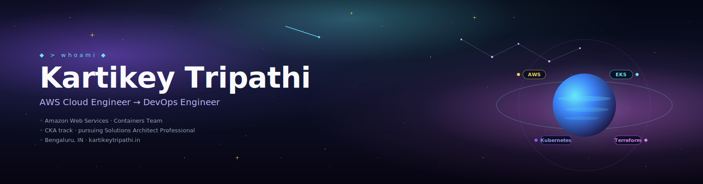

<div align="center">



<br/>

### ✦ *AWS Cloud Engineer transitioning into DevOps — publishing what I learn along the way* ✦

[](https://www.kartikeytripathi.in)
[](https://blogs.kartikeytripathi.in)
[](https://www.linkedin.com/in/kartikeytripathi)

</div>

---

## 🪐  Ident

```yaml
handle      : kartikeytripathi
alias       : LordKazeKage
role        : AWS Cloud Engineer — Containers Team
trajectory  : Cloud Support  →  DevOps  →  Platform Engineering
focus       : Kubernetes · EKS · IaC · CI/CD · Observability
currently   : CKA · AWS Solutions Architect Professional
station     : Bengaluru, IN
off-duty    : Netflix · video games · breaking prod (in labs, obviously)
```

---

## 🛰  The constellation

Five properties in orbit around a shared brand and shared writing voice.

| ✦ | Satellite | Purpose |
|---|---|---|
| ◆ | **[Portfolio](https://www.kartikeytripathi.in)** | Hub · bio · work · projects · certs · contribution graph |
| ◇ | **[Blog](https://blogs.kartikeytripathi.in)** | Long-form — EKS internals, ADOT, Karpenter, Lambda MicroVMs |
| ◈ | **[AWS Diagrams](https://diagrams.kartikeytripathi.in)** | Interactive architecture diagrams — searchable, filterable |
| ⎈ | **[KubeForge](https://kubeforge.kartikeytripathi.in)** | 38-lab hands-on K8s + EKS platform for CKA / DevOps prep |
| 🔍 | **[QuizLens](https://github.com/kartikeytripathi/quizlens)** | Chrome extension: highlight a practice question → get the full breakdown |

---

## ⚙  Ship systems

<div align="center">

**☁️  Cloud & AWS**


**🐳  Containers & orchestration**


**🛠  DevOps & IaC**


**🗄  Data & languages**


</div>

---

## 🎖  Flight record — certifications

| ✦ | Certification | Issuer | Status |
|---|---|---|---|
| ☁ | AWS Certified Solutions Architect — Associate | Amazon Web Services | `[EARNED · 2024]` |
| 🤖 | AWS Certified AI Practitioner | Amazon Web Services | `[EARNED · 2024]` |
| 🌩 | AWS Certified Cloud Practitioner | Amazon Web Services | `[EARNED · 2022]` |
| 🧠 | Foundations of AI Agents | BeSA | `[EARNED · 2026]` |
| ⎈ | CKA — Certified Kubernetes Administrator | CNCF | `[IN PROGRESS]` |
| 🏛 | AWS Solutions Architect Professional | Amazon Web Services | `[IN PROGRESS]` |

---

## 📡  Telemetry

<div align="center">

<a href="https://git.io/streak-stats">
  
</a>

<br/><br/>


</div>

---

## 📻  Signal

<div align="center">

[](https://www.kartikeytripathi.in/)
[](https://www.linkedin.com/in/kartikeytripathi/)
[](https://github.com/kartikeytripathi)

<br/>

```
✦   "In the cloud, we trust.  In Kubernetes, we debug."   ✦
```

<br/>


<br/>

<sub>*mission log · v2026 · orbit stable*</sub>

</div>
